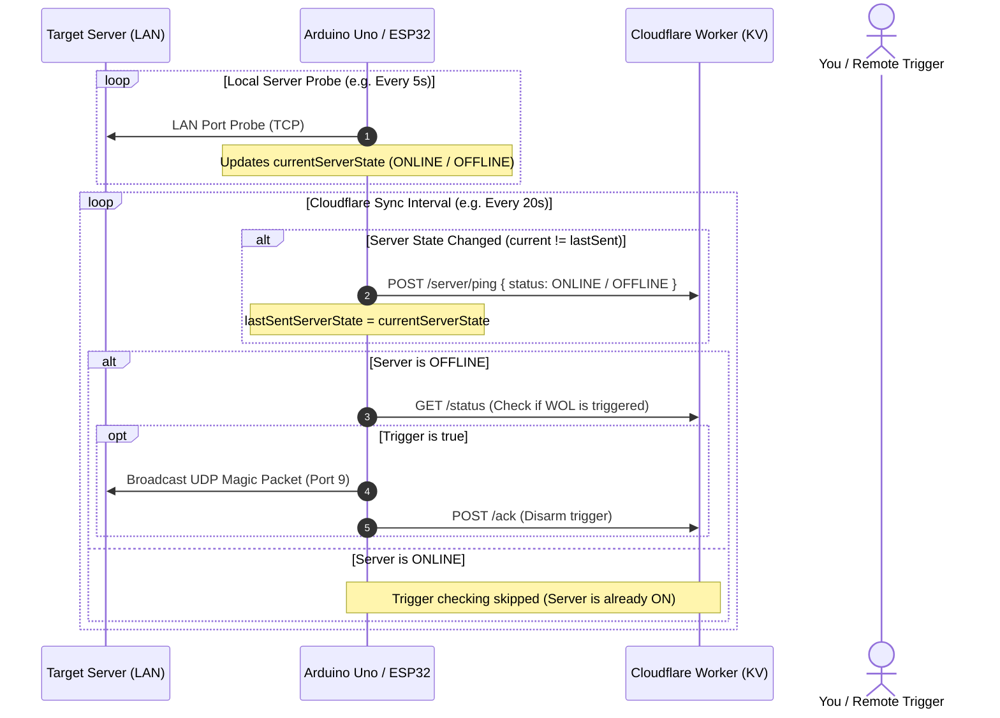

# cf-wake-on-lan

An Always-On Device (AOD) Wake-on-LAN (WOL) remote server starter powered by **Cloudflare Workers + Cloudflare KV (100% Free Tier)**.

### 🔌 Hardware Configuration
- **Primary Board**: **Arduino Uno R3 + ESP8266 ESP-12E WiFi Shield** (Dedicated Always-On WOL Controller)
- **Alternative / Backup Board**: **ESP32 Dev Board** (Alternative standalone firmware included)

---

## ⚡ Smart Polling & Trigger Flow



### 🧠 Flow Benefits:
1. **Separated Intervals**: Local LAN server probe runs fast (e.g., every 5s) without consuming internet bandwidth or Cloudflare quotas.
2. **State Memory (`current` vs `lastSent`)**: Cloudflare is only notified when the status actually changes, minimizing HTTP calls.
3. **Conditional Wake Checking**: When the server is already `ONLINE`, the board avoids unnecessary trigger processing. As soon as the server is `OFFLINE`, it monitors for WOL triggers on every sync cycle.

---

## 📁 Repository Structure

```
├── cloudflare-worker/
│   ├── package.json
│   ├── wrangler.toml
│   └── src/
│       └── index.js
├── firmware/
│   ├── config.h.example
│   ├── esp32/
│   │   └── esp32_wol.ino
│   └── arduino_uno_esp8266/
│       └── arduino_uno_esp8266_wol.ino
├── .gitignore
└── README.md
```

---

## 🚀 Cloudflare Worker Setup (Free Tier)

You can deploy the Worker directly from this repository using either the **Cloudflare Dashboard (Git Integration)** or the **Wrangler CLI**.

### Option 1: Direct Cloudflare Dashboard (Deploy from Git)
1. Push this repository to your GitHub/GitLab account.
2. In the **Cloudflare Dashboard**:
   - Go to **Workers & Pages** -> **Create application** -> **Workers** -> Select **Connect to Git**.
   - Select your repository (`cf-wake-on-lan`).
   - The root [`wrangler.toml`](file:///Users/janlofredy/Documents/ServerStarter/wrangler.toml) will be detected automatically.
3. In **Settings -> Bindings**:
   - Add a **KV namespace binding**:
     - Variable name: `WOL_STORE`
     - KV namespace: Select or create `WOL_STORE`.
4. In **Settings -> Variables and Secrets**:
   - Add Secret: `API_KEY` (set your secret authorization token).
5. Click **Save and Deploy**. Cloudflare will automatically build and deploy every time you push changes!

---

### Option 2: Deploy via CLI (Wrangler)
1. Log in to Cloudflare:
   ```bash
   npx wrangler login
   ```
2. Create the free KV namespace:
   ```bash
   npx wrangler kv namespace create WOL_STORE
   ```
3. Copy the generated `id` and paste it into [`wrangler.toml`](file:///Users/janlofredy/Documents/ServerStarter/wrangler.toml).
4. Set your secret token:
   ```bash
   npx wrangler secret put API_KEY
   ```
5. Deploy:
   ```bash
   npm run deploy
   ```

---

### 2. Microcontroller Setup

#### 🌟 Primary Choice: Arduino Uno + ESP8266 ESP-12E Shield
1. Mount the ESP8266 ESP-12E WiFi shield directly on top of the Arduino Uno.
2. Configure shield DIP switches / jumpers:
   - For **SoftwareSerial mode** (Uno Pins D2 as RX, D3 as TX): Set DIP switches according to the shield's pin diagram (or route jumpers from shield TX -> Uno D2, shield RX -> Uno D3).
3. Open [`arduino_uno_esp8266_wol.ino`](file:///Users/janlofredy/Documents/ServerStarter/firmware/arduino_uno_esp8266/arduino_uno_esp8266_wol.ino).
4. Update:
   - `WIFI_SSID` & `WIFI_PASSWORD`
   - `CF_HOST` (e.g. `YOUR_WORKER_SUBDOMAIN.workers.dev`)
   - `AUTH_TOKEN` (your secret key)
   - `SERVER_MAC` (target server's MAC address)
5. Select **Arduino Uno** in Arduino IDE and upload.
6. Power the Uno via a 5V USB adapter or DC barrel jack (7-12V). It operates as an AOD (Always-On Device), booting and polling automatically.

---

#### 🔄 Alternative Choice: ESP32 Dev Board (Backup Option)
*(Use this if you ever repurpose the Arduino or need a standalone board)*
1. In Arduino IDE:
   - Install **ESP32 by Espressif Systems** via Boards Manager.
   - Install **ArduinoJson** via Library Manager.
2. Copy `firmware/config.h.example` to `firmware/config.h` and populate your network & Cloudflare credentials.
3. Open [`esp32_wol.ino`](file:///Users/janlofredy/Documents/ServerStarter/firmware/esp32/esp32_wol.ino), select your ESP32 board, and upload.

---

### 3. Triggering Wake-on-LAN from Anywhere

Send an authenticated HTTP POST request to trigger the server boot from anywhere (curl, iOS Shortcuts, Tasker, or browser):

```bash
curl -X POST "https://YOUR_WORKER_SUBDOMAIN.workers.dev/trigger" \
  -H "Authorization: Bearer YOUR_SECRET_TOKEN" \
  -H "Content-Type: application/json"
```

*(Optional)* Trigger a specific MAC address dynamically:
```bash
curl -X POST "https://YOUR_WORKER_SUBDOMAIN.workers.dev/trigger" \
  -H "Authorization: Bearer YOUR_SECRET_TOKEN" \
  -H "Content-Type: application/json" \
  -d '{"mac": "11:22:33:44:55:66"}'
```

---

## ⚙️ Free Tier Quota Details (Cloudflare KV)
- **Reads**: 100,000 / day
- **Writes**: 1,000 / day
- At a 30-second polling interval: `(86,400s / 30s) = 2,880 reads/day` (under **3%** of the free daily limit).
